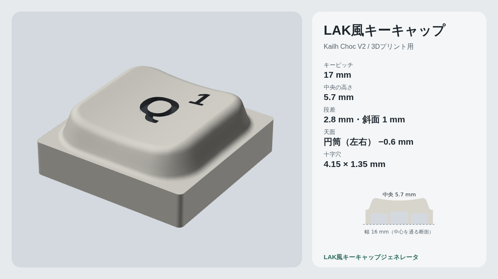

# LAK風キーキャップジェネレータ

LAKスタイルのロープロファイルキーキャップを、ブラウザ上でパラメータを調整しながら設計し、3Dプリント用のSTL / 3MF / OpenSCADで出力できるツールです。Kailh Choc V2（MX互換の十字軸）用です。

ZMK Studio対応のキーボードに直接つなぐと、キーマップを読み込んでLegend（刻印）付きのキーキャップを全キー分まとめて作れます。

**▶ デモ：https://kamabokoz.github.io/LakStyleKeycapGenerator/**



## 主な機能

- **形状のパラメータ調整**：キーピッチ、外周帯と中央部の段差（傾斜幅・肩R・裾R）、天面の曲面（球面／円筒、凸／凹）、肉厚、十字穴の寸法など。3D・断面プレビューで確認しながら調整できます。
- **キーマップからLegendを生成**：USB / Bluetooth（ZMK Studio RPC）でキーボードからキーマップを読み込み、キーごとに表示するレイヤー・位置・文字を設定できます。ホストPCのJIS / US配列に合わせて記号を表示します。
- **Legendのフォント**：日本語対応8種・英数字向け5種のWebフォントに加えて、PCにインストールしたフォントや、手元のフォントファイル（TTF / OTF / WOFF / WOFF2）も使えます。
- **Legendは彫り込み（面一）または浮き彫り**：彫り込みの場合は、はめ込み用のLegendパーツも出力するので、2色印刷（AMSなど）に使えます。
- **出力形式**
  - STL（ZIP）：キーごとの本体、はめ込みLegend、刻印用OpenSCAD
  - 3MF：全キーをプレートに並べ、各キーを「本体＋Legend」の2パーツにした1ファイル（Bambu Studio / OrcaSlicer向け、フィラメント番号つき）
  - OpenSCAD：同じ形状を再現できるパラメトリックなソース
- **プリセットと保存履歴**：ブラウザ内に保存し、名前の変更や呼び出しができます。
- **Xに投稿**：プレビュー画像を作り、パラメータを埋め込んだリンク（`#k=…`）と一緒に投稿できます。リンクを開くと同じ形が表示されます。

## 使い方

1. デモページを開くか、このリポジトリをダウンロードして `index.html` をブラウザで開きます。ビルドは不要です。
2. 右側のパラメータで形を調整します。初期値はオリジナルのLAKに近い形です。
3. 1キーだけ作る場合は「STLを保存」を押します。
4. Legend付きで作る場合は「キーマップとLegend」で次のように進めます。
   1. 「USBで接続」または「Bluetoothで接続」を押し、キーボードを選びます。DYA Studio / ZMK Studioは先に切断してください。
   2. キーボードのアンロック操作（`&studio_unlock`）を押すと、キーマップが読み込まれます。
   3. 配列図でキーを選び、表示するレイヤーと位置を設定します。「位置の微調整」で0.1mm単位でずらせます。
   4. 出力形式を選んで保存します。

キーボードがない場合は「サンプルで試す」で動作を確認できます。

### 2色印刷（Bambu Studioの例）

- **3MFで出力した場合**：ファイルを開くだけで、各キーが本体とLegendの2パーツになっています。フィラメントの割り当てを確認して印刷してください。
- **STLで出力した場合**：同じ番号の `keys/XX.stl` と `inlay/XX_legend.stl` を同時に読み込み、「1つのオブジェクトとして読み込む」を選んでから、Legendパーツに別のフィラメントを割り当てます。

彫り込みの深さを積層ピッチの倍数（0.2mmピッチなら0.4 / 0.6mm）にすると、色の境目がきれいに出ます。

### 印刷のヒント

- 十字穴の寸法はプリンタによって合い方が変わります。「ステム」の欄にFDM用と光造形用のプリセットがあります。きつい・緩い場合は0.05mm刻みで調整してください。
- 初期値の形は、天面を上にしてそのまま印刷できます（サポート不要）。

## 対応ブラウザ

| 機能 | 対応 |
| --- | --- |
| 形状の調整・STL / 3MF出力 | 主要なモダンブラウザ |
| USB接続（Web Serial） | PCのChrome / Edge |
| Bluetooth接続（Web Bluetooth） | Chrome / Edge（Android含む）、iOSはBluefyなど |
| 画像付きでXアプリに共有 | 共有メニューでファイルを渡せる環境（主にスマホ） |

USB / Bluetooth接続にはhttps（GitHub Pagesなど）か、ローカルファイルとして開く必要があります。

## Xへの投稿と共有リンク

GitHub Pagesなどhttpsで公開したページでは、そのURLが共有リンクの公開先として自動で使われます。別の場所で使う場合は、投稿画面の「リンクの公開先URL」に公開ページのURLを設定してください。

リンクの `#k=` 以降には、初期値から変えたパラメータだけがエンコードされています。サーバーには送信されません。

## ファイル構成

```
index.html            画面
css/style.css         スタイル
js/geom.js            キーキャップのメッシュ生成、STL / 3MF / ZIP出力
js/legend.js          文字の輪郭抽出・三角形分割・立体化
js/zmk.js             ZMK Studio RPCクライアント（USB / Bluetooth）
js/labels.js          キー割り当て → Legend文字の変換
js/scad-body.js       出力するOpenSCADのソース
js/app.js             パラメータUI、検証、プレビュー、保存
js/share.js           Xへの投稿、共有リンク
js/keymap.js          キーマップ読み込み、Legend設定、一括出力
js/main.js            起動処理
scad/lak_keycap.scad  単体で使えるOpenSCADファイル
tools/build_single.py 1ファイル版HTMLの生成
tests/mesh-check.js   メッシュの検証
docs/                 README用の画像
```

スクリプトはESモジュールではなく通常の `<script>` で読み込んでいます。ローカルファイルとして開いてもそのまま動かすためです。

## 開発

依存パッケージもビルド工程もありません。ファイルを編集してブラウザで開き直すだけで確認できます。

```sh
# メッシュが閉じた形状になっているかの検証（Node.js 18以降）
node tests/mesh-check.js

# 1ファイルにまとめたHTMLを生成（オフライン配布用） → dist/lak-keycap-generator.html
python3 tools/build_single.py
```

### GitHub Pagesでの公開

リポジトリの Settings → Pages で「Deploy from a branch」を選び、`main` ブランチの `/ (root)` を指定します。公開後は、`index.html` の `og:image` とこのREADMEの `kamabokoz` を自分のURLに書き換えてください。

## 既知の制限

- 3MFのフィラメント自動割り当ては、Bambu Studio独自の形式に合わせて書いています。スライサーのバージョンによっては反映されないことがあります。その場合でもパーツ構成は残るので、手動で割り当てられます。
- Bluetooth接続は、機種やOSによっては候補に表示されないことがあります。一覧に出ない場合は「すべてのデバイスから選ぶ」を使ってください。
- オリジナルのLAKにある、底面から少し飛び出したステムや裏側の形状は再現していません。

## 注意事項

このツールは非公式のファンメイドです。オリジナルの「LAK」キーキャップの製造・販売元とは関係ありません。初期値の形状は、公開されている図面と写真から推定したもので、実物の寸法とは異なる場合があります。

## ライセンス

[MIT License](LICENSE)

Legend用のWebフォント（IBM Plex Sans JP、Noto Sans JP、M PLUS Rounded 1c、Zen Maru Gothic、BIZ UDPGothic、M PLUS 1 Code、Kosugi Maru、Dela Gothic One、Inter、Barlow、Roboto Mono、JetBrains Mono、Orbitron）は、選んだときにGoogle Fontsから読み込みます。各フォントのライセンス（SIL Open Font License / Apache License 2.0）に従います。
