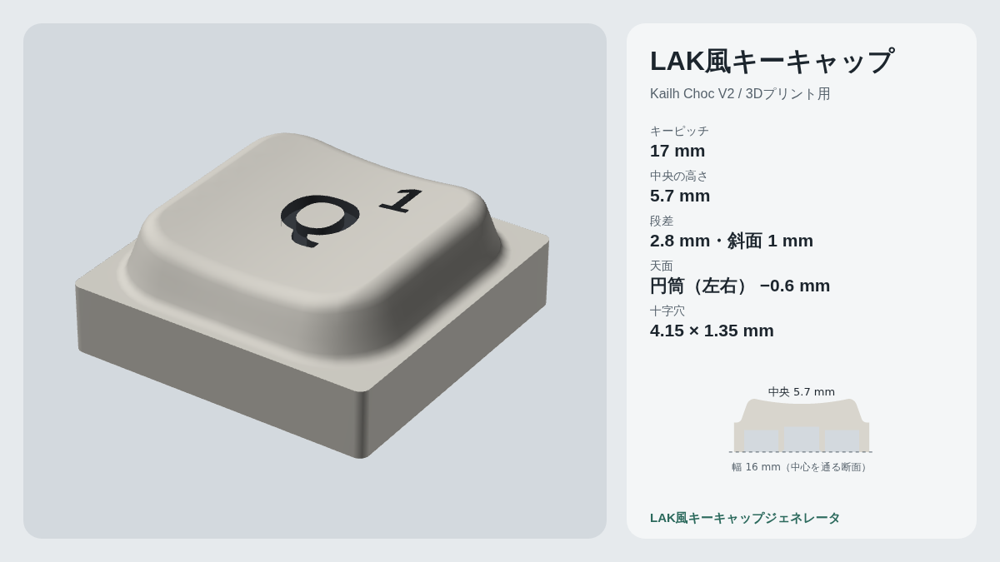

# LAK風キーキャップジェネレータ

LAKスタイルのロープロファイルキーキャップを、ブラウザ上でパラメータを調整しながら設計し、3Dプリント用のSTL / 3MF / OpenSCADで出力できるツールです。Kailh Choc V2（MX互換の十字軸）用です。

ZMK Studio / Vial対応のキーボードに直接つなぐと、キーマップを読み込んでLegend（刻印）付きのキーキャップを全キー分まとめて作れます。

**▶ デモ：https://kamabokoz.github.io/LakStyleKeycapGenerator/**



## 画面の構成

- **左**：3Dプレビュー（斜め・横・底面・3キー並び・断面・全体・サイズ見本）と、その下の**フィラメントのバー**（どのフィラメントが何を印刷するか）。バーを押すと出力タブの割り当て表に移ります。
- **右のタブ**：「形状」「キーマップ」「Legend」「天面アート」「出力」。スマホでは画面下のタブバーになります。選んだタブは次に開いたときも残ります。
- **保存ボタン**：右列の下（スマホではタブバーの上）に常に表示される1つのボタンです。出力タブで選んだもの（キーの形だけ／全キー／選択中のキー／Legendのサイズ見本）と形式に合わせて「STLを保存」「3MFを保存」などに変わります。
- **上部**：「プリセット・履歴」（保存した設定を開くパネル）と「Xに投稿」。

## 主な機能

- **形状のパラメータ調整**：キーピッチ、外周帯と中央部の段差（傾斜幅・肩R・裾R）、天面の曲面（球面／円筒、凸／凹）、肉厚、十字穴の寸法など。3D・断面プレビューで確認しながら調整できます。
- **キーマップからLegendを生成**：ZMK（USB / Bluetooth、ZMK Studio RPC）とVial（USB、WebHID）のキーボードからキーマップと全レイヤーを読み込み、キーごとに表示するレイヤー・位置・文字を設定できます。ホストPCのJIS / US配列に合わせて記号を表示します。文字の太さ（標準／太字）はレイヤーごとに選べます。
- **SVG画像のLegend**：SVGファイル（ロゴ・アイコン）を追加して、文字の代わりに印字したり、ロゴとして文字と並べて印字したりできます。濃い色の部分（または描かれた部分すべて）が印字され、倍率で大きさを調整できます。彫り込み・浮き彫り・3MFの色分けにも対応します（engraved.scadには入りません）。Shift・Enter・Backspace・矢印・音量・メディア操作・⌘⌥⌃などのアイコン47種を内蔵しており、「おすすめの画像から選ぶ」で追加できます。「キーの文字をアイコンに置き換える」で、Shift・Enter・矢印・音量などの文字を一括でアイコンにできます（元にも戻せます）。
- **天面アート**：複数のキーの天面にまたがる大きな絵を印字できます。絵は**グループ**ごとに好きな位置・大きさ・向きで置け、1枚のキーボードに複数の絵を並べられます（例：左手側に山、右手側に月、親指キーに肉球）。1つのグループには色ごとに分けたSVG（同じアートボードから書き出したもの）をまとめて読み込むと、SVGの原点をそろえて重ね、SVGごとのフィラメントで印字します。配置図では絵をクリックするとそのグループを選べ、ドラッグで移動、丸いつまみで回転〔Shiftで15°刻み〕、角で拡大縮小できます（幅・高さ・位置・回転は数値やボタンでも調整可）。「縦横比を保つ」を外すと縦と横を別々に伸縮でき、配置図の角で縦横を自由に、辺のつまみで横だけ・縦だけを伸ばせます（Shiftを押しながら角をドラッグすると比率を保ちます）。グループは「複製」で同じ絵をいくつも置けるほか、手前／奥の入れ替え、表示の切り替え、SVGを別のグループへ移すこともできます。重なった部分は上にあるグループ（グループ内では上にあるSVG）が優先されます。「サンプルの絵・図形から追加」には、太陽と波と山・雪山と朝日・青海波・桜吹雪・月と星空・回路パターンの横長の絵と、肉球・流れ星・桜のワンポイントの絵（すべてオリジナル、色ごとに分けたSVG）に加えて、丸・四角・角丸四角・三角・ひし形・六角形・星・ハート・輪・矢印・十字・ストライプのシンプルな図形（1色）を用意しています。図形は縦横比を外して伸ばせば、楕円や帯、長方形としても使えます。同じSVGは `samples/art/`（図形は `samples/art/shapes/`）にもあります。SVGを追加すると、SVGで一番多く使われている色がそのフィラメントの色になり、同じ色のフィラメントがあればそれを使います。3MFでは別パーツ、STLでは `art/` フォルダに出力されます。各キーの天面（中央部）で切り取られ、キーのない部分は無視されます。Legendを優先してアートを抜くか、アートだけにするかを選べます（engraved.scadには入りません）。印字する範囲は「天面の中央部のみ」と「外周帯も含める」から選べます。外周帯も含める場合、段差が斜面の天面（標準のLAK形状・なだらか）では段差を含む天面全体に、垂直な段差では外周帯と中央部に印字します。天面アートが有効なときの3MFは、キーをキーボードと同じ位置・向きで並べて出力します（「並べ方」で格子状に詰めることもできます。プレートからはみ出す場合はスライサーで調整してください）。
- **フィラメントの割り当て**：出力タブの「フィラメントの割り当て」表に、本体・Legend（レイヤーごとに色分けした場合はレイヤーごと）・天面アートのSVGごとの用途が並び、それぞれのフィラメント番号と色をまとめて決められます。同じ番号にした用途は同じフィラメントになり、色を変えるとその番号を使うすべての用途に反映されます。プレビューはこの色で表示されます。「3MFにフィラメントの色を書き込む」（初期値はオフ・試験的）をオンにすると、3MFにも色を書き込み、Bambu Studio / OrcaSlicerで開いたときに色が付きます。
- **3D表示の操作**：ドラッグで回転、右ドラッグ（中ボタンのドラッグ、Shift＋ドラッグでも可）でカメラを上下左右に移動します。回転は移動した先を中心にします。ダブルクリック、または表示（斜め・横・底面など）を切り替えると中央に戻ります。Xに投稿する画像も、移動したカメラのまま作ります。
- **全体プレビュー**：キーマップを読み込むと、3D表示に「全体」が出ます。キーボード全体を実際の配列（回転キーを含む）で並べ、Legend・マーク・ホーミング突起・天面アートをフィラメントの色で表示します。ホイールで拡大縮小でき、この表示のままXに投稿すると、投稿画像もキーボード全体になります。
- **レイヤーキーのマーク**：MO・TG・TOなどのレイヤーキーと、ベースレイヤーのLayer-Tapに、切り替え先レイヤーを表すマーク（丸・四角・三角・バー）を印字できます。3MFで「レイヤーごとに色分け」にすると、マークは切り替え先レイヤーの色になります。レイヤー切り替えだけのキーは文字を省いてマークだけにもできます（マークはengraved.scadには入りません）。
- **編集中のパラメータの復元**：形状パラメータを初期値から変えると、編集中の内容として自動で保存されます。次にページを開いたとき、前回編集していたパラメータがあれば、変えた項目の一覧とともに「読み込む／初期値で始める」を確認します。「初期値で始める」を選んでも、前回の設定は履歴に残ります（共有リンクから開いたときは確認せず、リンクのパラメータを使います。そのとき編集中だった設定は履歴に残し、その旨を表示します。読み込んだリンクはアドレスから外すので、そのあと再読み込みしてもリンクの値で上書きされず、リンクを開いてからの編集を確認のうえ読み込めます）。
- **ホーミング**：バー／ドットの形、長さ・太さ・高さ・位置を調整できます。突起は天面の曲面に沿って付くので、へこんだ天面でも高さがそろいます。キーマップを読み込んでいるときにオンにすると、まずF・Jキーに付き、プレビューも突起の付いたキーに切り替わります。付けるキーはキーごとに変えられます。方式は「突起」「凹み」「差し込み穴」から選べます。「凹み」は天面を彫り込んだ溝・くぼみ（幅と深さを指定。目安は幅1mm以上・深さ0.4〜0.6mm）で、「差し込み穴」は天面に穴を開け、印刷後に部品を差して接着します（バー／ドットを選べます。穴の幅、部品のすき間〔片側〕、部品の出っ張りを指定）。差し込む向きは2通りです。「上から（止まり穴）」は天面から指定の深さの穴を開け（ドットなら1.75mmフィラメントの切れ端も使えます。径1.85〜1.95mm）、「下から（貫通・つば付き）」は天面まで貫通した穴と、キーの内側の天井に深さ0.6mm・片側0.8mm広い座ぐりを開けます。下からの部品は下につばが付いた形で、キーキャップの内側から差し込むと、つばが座ぐりに当たって出っ張りの高さが決まり、上には抜けません（押される向きは接着で固定）。座ぐりはステムにかからないよう自動で少し外側にずらし、それでもかかる・天井からはみ出す・天面が薄い場合はエラーで知らせます。どちらも天面に出っ張りがないので、Legendを多色（AMSなど）で刷るときに天面を下にして印刷できます。差し込み穴では、差し込む部品（穴よりすき間の分だけ細い柱に丸い頭。下からの場合はつば付き。そのままの向きで印刷）もSTL（homing_pin.stl / homing_pins.stl）や3MF（homing_pins）に入ります。凹み・穴が深すぎて天面の裏に届く場合や、十字穴とつながる場合はエラーで知らせます。OpenSCADファイルにも凹み・穴（homing_cut）と差し込む部品（homing_insert）が入ります。
- **Legendのサイズ見本**：出力タブで「Legendのサイズ見本」を選び、見本の文字と大きさ（例：`1.5, 2, 2.5, 3`）を入れると、Legendが潰れないかを試し刷りする3MFを保存できます。キーの形は作らず、薄い1枚の板（彫り込みは深さ＋0.6mm、浮き彫りは1mm）を格子状に区切り、大きさごとのマスに今のフォント・彫り込み／浮き彫りの設定で見本の文字を印字します。各マスの見本の下に大きさ（例：`2.5`、標準と太字の両方を作る場合は `2.5N` / `2.5B`）を刻むので、印刷後もどの大きさか分かります。マスは文字に合わせた大きさで、大きさごとの行を左詰めに積むため（階段状の板）、フィラメントは数gで済みます。「3Dでプレビュー」で3D表示が「サイズ見本」に切り替わり、板の寸法・厚さ・おおよその重さ（PLA）と一緒に確認できます（見本の文字や大きさを変えるとプレビューも追従します）。
- **保管トレー**：出力タブで「保管トレー」を選ぶと、作ったキーキャップをキーボードと同じ並び（回転したキーも）のまま保管するトレーと蓋を出力できます。トレーの底には各キーの位置にMX互換の十字の突起があり、キーキャップをスイッチのように差して固定します（固さは「ゆるめ／標準／きつめ」）。並べ方は「キーボードの配列どおり」と「格子状」から選べます。「格子状」はキーボードの配列を使わず、同じ大きさのマスを縦横に並べます（列・行は1〜20、マスの間隔は初期値がキーピッチ）。キーマップを読み込まなくても作れ、読み込んでいるときは「キーの数に合わせる」でプレートに収まる列×行を自動で選べます。格子状では「予備のキーキャップ」と「左右で分ける」は使いません。突起の代わりに「仕切り」を選ぶと、各キーのまわりに低い仕切り（幅0.8mm、高さは0.8〜4mmで初期値1.5mm）だけを付け、キーキャップを置くだけで並びがそろいます。仕切りのクリアランス（キーキャップと仕切りのすき間・片側）は「きつめ0.2／標準0.35／ゆるめ0.5／かなりゆるめ0.7mm」から選ぶか、0.1〜1.5mmの数値で指定できます。クリアランスと仕切りが元のキーの間隔に収まらないときは、キーの位置を自動でずらします（全体の間隔を均等に広げたうえで、回転したキーなどまだ近すぎるキーを個別に押し離します。角度の違うキーどうしは、それぞれの仕切りが相手のクリアランスに入らない距離まで離します）。格子状では、マスの間隔を必要な距離まで自動で広げます。「なし」は平らな底です。蓋はキーの上に窓があり中が見えます。窓を開けるキーは「窓を開けるキー」の配置図で選べます（キーをクリックで窓の有無を切り替え、ドラッグでまとめて切り替え。「すべて開ける／すべて閉じる／反転」も可。予備のキーキャップや格子状のマスも同じように選べます）。窓のないキーの上には名前やアートを置けます。窓を透明フィラメントの別パーツで埋める（3MFで2色印刷）か、窓なしの蓋を透明フィラメントで印刷することもできます。ロックの方式は4種類から選べます（初期値は「ワンタッチ」。キーの固定の初期値は「仕切り」）。「ツメ」は蓋のスカートをスリットで切り離したツメがトレーの壁の突起にパチンと掛かり、ツメ下のつまみを外へ引くと外れます。「ワンタッチ」は蓋を押すとパチッとはまり、引き上げると外れます（蓋の長辺の内側の出っ張りが、両側に斜面のある壁の突起を乗り越えます）。「スライド」は蓋をトレーの右端から差し込んでレールに沿って滑らせ、奥まで入れると蓋の裏の出っ張りが入口の壁の内側にカチッと掛かります（レールの返しは45°なのでサポート不要。開けるときは右端のつまみを少し持ち上げて引き出します）。「なし」はかぶせるだけです。ロックの強さは「弱／標準／強」で調整できます。「仕様の刻印」をオンにすると、Xに投稿する画像のように、名前・キーキャップの形のパラメータ（キーピッチ・中央の高さ・天面の幅・外周の高さ・段差・天面の曲面・十字穴・ホーミング）・中心の断面図をまとめた板を、トレーの裏（底の外側、深さ0.4mm）か蓋の上に入れられます。どちらも印刷するとき下になる面なので、「2色（はめ込み）」にしても色替えは最初の数層だけです（フィラメントは割り当て表の「仕様の刻印（2色）」）。入れる内容（名前・パラメータ・断面図・枠）、名前の文字、文字の大きさ（2〜8mm、初期値2.5mm）、90°ずつの回転を選べ、位置は配置図でドラッグして調整します。トレーの裏は、手前に倒して裏返したときに読める向き（前後を反転）で入れ、配置図もその向きで表示します。蓋の上では窓と重ならない場所に置きます（「窓を開けるキー」で窓を閉じたキーの上にも置けます）。はみ出す・窓や名前と重なる場合は赤で表示され、その位置には入りません。「アート（SVG）」をオンにすると、天面アートと同じ要領で、色ごとに分けたSVGをグループにまとめて蓋の上かトレーの底に入れられます（サンプルの絵・図形からも追加可）。配置図で絵をドラッグして移動、角で拡大縮小し、幅・回転は数値でも調整できます。SVGごとのフィラメントで、彫り込んだ部分を埋めるパーツとして出力します（3MFで多色印刷）。窓・キーキャップの位置・名前とは重ならないように自動で切り抜きます。「予備のキーキャップ」の配置図で空いているマスをクリックすると、予備のキーキャップ用の場所（十字の突起と蓋の窓）を追加できます（もう一度クリックで削除、ドラッグで移動）。キーと干渉しないよう、場所はキーピッチの格子に沿って置かれ、キーと重なるマスには置けません。「手前に1列並べる」でキーの手前に1列まとめて追加することもできます。キーの外に置くと、トレーと蓋がその分大きくなります。「名前の刻印」をオンにすると、蓋の上かトレーの底（内側）に名前（キーキャップのセット名など）を入れられます。名前は複数入れられ、「左右で分ける」ときは「トレーごとに1つずつ用意」で左右それぞれに別の名前（例：Corne 左／Corne 右）を入れられます。場所・仕上げ・大きさ・位置・向きは名前ごとに選べます。名前には装飾も付けられます（四角枠・角丸枠・カプセル枠・二重枠・下線・角かっこ・両側に飾り〔──◆ 名前 ◆──〕・白抜き〔塗りつぶした板から文字を抜く〕。枠や線の太さは細い／標準／太い）。装飾は名前と同じ仕上げ（彫り込み・2色）で入ります。仕上げは「彫り込み」と「2色（はめ込み）」から選べ、2色では文字を別のフィラメントのパーツで埋めます（蓋は天面を下にして印刷するので、名前は最初の数層に入ります）。位置は配置図でドラッグして調整でき、90°ずつ回転もできます。窓やキーキャップの下に重なる場合は赤で表示され、その位置には入りません。「名前用の余白をキーの手前に足す」で、文字を入れるスペースをトレーの手前に確保できます。分割キーボードは「左右で分ける」で左右別々のトレーにでき、プレートに収まりやすくなります。トレーはそのままの向き、蓋は上下逆さ（天板が下）の向きで出力するので、どちらもサポートなしで印刷できます。「保管トレー」を選ぶと3D表示がトレーに切り替わり、保存前に形を確認できます。設定を変えるとその場で作り直し、「蓋を外して／蓋を閉じて」の表示切り替えや、キーキャップを入れた状態・空の状態も選べます（3D表示の「トレー」ボタンでも開けます）。
- **Legendのフォント**：日本語対応8種・英数字向け5種のWebフォントに加えて、PCにインストールしたフォントや、手元のフォントファイル（TTF / OTF / WOFF / WOFF2）も使えます。
- **Legendは彫り込み（面一）または浮き彫り**：彫り込みの場合は、はめ込み用のLegendパーツも出力するので、2色印刷（AMSなど）に使えます。
- **出力形式**
  - STL（ZIP）：キーごとの本体、はめ込みLegend、刻印用OpenSCAD
  - 3MF：全キーをプレートに並べ、各キーを「本体＋Legend」のパーツにした1ファイル（Bambu Studio / OrcaSlicer向け、フィラメント番号つき）。Legendは「レイヤーごとに色分け」にすると、レイヤーごとに別パーツ・別フィラメントになります（例：Baseは黒、Numは緑）。
  - OpenSCAD：同じ形状を再現できるパラメトリックなソース
- **プリセットと保存履歴**：ブラウザ内に保存し、名前の変更や呼び出しができます。
- **Xに投稿**：プレビュー画像を作り、パラメータを埋め込んだリンク（`#k=…`）と一緒に投稿できます。リンクを開くと同じ形が表示されます。作業中の画面で共有リンクを開いた場合は、それまでの設定を保存履歴に残し、「元に戻す」で戻せます。投稿画面の「画像の見た目を調整」で、3Dビューワーをその場で回転・拡大縮小したり、斜め／横／3キー並び／全体／真上を切り替えたりでき、投稿画像がその見た目で作り直されます。

## 使い方

1. デモページを開くか、このリポジトリをダウンロードして `index.html` をブラウザで開きます。ビルドは不要です。
2. 「形状」タブのパラメータで形を調整します。初期値はオリジナルのLAKに近い形です。
3. 1キーだけ作る場合は、そのまま保存ボタン（「STLを保存」）を押します。出力タブの「キーの形だけ（1個）」の状態です。
4. Legend付きで作る場合は「キーマップ」タブで次のように進めます。
   1. DYA Studio / ZMK Studioは先に切断してください。
   2. ZMKのキーボードをUSBでつなぐ場合は「ZMK（USB）」を押してポートを選び、キーボードのアンロック操作（`&studio_unlock`）を押すとキーマップが読み込まれます。
   3. Bluetoothの場合は「ZMK（Bluetooth）」を押してキーボードを選び、アンロック操作をします。一覧には、ZMKキーボードが広告しているバッテリーサービスを持つ機器が表示されます。キーボードが出ない場合は「すべてのデバイスから選ぶ」を使ってください。
   - Vialのキーボードは、Vialアプリを閉じてから「Vial（USB）」を押して選びます。アンロックは不要です。キー配列（レイアウトオプションを含む）もキーボードから読み込みます。VIAのみ（Vialでない）のキーボードは、先にVIA用のキーボード定義JSONを「ファイルから読込」で読み込んでから接続してください。
   - Vialで保存した `.vil` ファイルも「ファイルから読込」で読み込めます。`.vil` にはキー配列が入っていないため、キーボード定義（vial-qmkの `keyboards/…/keymaps/vial/vial.json`）も一緒に選ぶと実際の配列で表示されます（定義がない場合は行×列の並びで表示します）。
   うまくつながらない場合は「接続ログ」に各段階の結果が出ます。
   4. 配列図でキーを選び、表示するレイヤーと位置を設定します。「位置の微調整」で0.1mm単位でずらせます。ホーミング突起を付けるキーもここで選べます。フォントや大きさ、太さ、マーク、画像は「Legend」タブ、大きな絵は「天面アート」タブで設定します。
   5. 「出力」タブで作るもの（全キー／選択中のキー）と形式（STL・3MF）、フィラメントの割り当てを決めて、保存ボタンを押します。

キーボードがない場合は「サンプルで試す」で動作を確認できます。

### 2色印刷（Bambu Studioの例）

- **3MFで出力した場合**：ファイルを開くだけで、各キーが本体とLegend（レイヤーごとに色分けした場合はレイヤーの数だけ）のパーツになっています。フィラメントの割り当てを確認して印刷してください。色分けした場合、プレビューのLegendはフィラメント番号ごとの色で表示されます。
- **STLで出力した場合**：同じ番号の `keys/XX.stl` と `inlay/XX_legend.stl` を同時に読み込み、「1つのオブジェクトとして読み込む」を選んでから、Legendパーツに別のフィラメントを割り当てます。

細い文字や小さい文字が潰れないか心配な場合は、先に出力タブの「Legendのサイズ見本」の3MFを印刷して、読める最小の大きさを確かめてから本番のLegendの大きさを決めると確実です。

彫り込みの深さを積層ピッチの倍数（0.2mmピッチなら0.4 / 0.6mm）にすると、色の境目がきれいに出ます。

### 印刷のヒント

- 十字穴の寸法はプリンタによって合い方が変わります。「ステム」の欄にFDM用と光造形用のプリセットがあります。きつい・緩い場合は0.05mm刻みで調整してください。
- 初期値の形は、天面を上にしてそのまま印刷できます（サポート不要）。

## 対応ブラウザ

| 機能 | 対応 |
| --- | --- |
| 形状の調整・STL / 3MF出力 | 主要なモダンブラウザ |
| USB接続（Web Serial） | PCのChrome / Edge |
| Bluetooth接続（Web Bluetooth） | Chrome / Edge（Android含む）、iOSはBluefyなど |
| 画像付きでXアプリに共有 | 共有メニューでファイルを渡せる環境（主にスマホ） |

USB / Bluetooth接続にはhttps（GitHub Pagesなど）か、ローカルファイルとして開く必要があります。

## Xへの投稿と共有リンク

投稿画面の「キーキャップの名前」を変えると、投稿画像の見出し（初期値は「LAK風キーキャップ」）、投稿文の「」内、共有リンクに入る名前がまとめて変わります。投稿文を手で書き換えていても、「」で囲んだ名前の部分だけが置き換わります。

GitHub Pagesなどhttpsで公開したページでは、そのURLが共有リンクの公開先として自動で使われます。別の場所で使う場合は、投稿画面の「リンクの公開先URL」に公開ページのURLを設定してください。

リンクの `#k=` 以降には、初期値から変えたパラメータだけがエンコードされています。サーバーには送信されません。

## ファイル構成

```
index.html            画面
css/style.css         スタイル
js/geom.js            キーキャップのメッシュ生成、STL / 3MF / ZIP出力
js/legend.js          文字の輪郭抽出・三角形分割・立体化
js/zmk.js             ZMK Studio RPCクライアント（USB / Bluetooth）
js/icons.js           内蔵のSVGアイコン
js/art.js             天面アート（複数キーにまたがる絵、グループごとの配置）
js/artsamples.js      天面アートのサンプルの絵（tools/make_art_samples.py で生成）
js/overview.js        全体プレビュー
js/tray.js            保管トレーと蓋（配列どおり／格子状、十字の突起、窓、ロック）
js/layout.js          画面の枠組み（タブ、プリセット・履歴のパネル、出力タブと保存ボタン、フィラメントの割り当て表とバー）
js/sample.js          Legendのサイズ見本（格子状の試し刷りプレートの3MF）
js/vial.js            Vial / VIA対応（WebHID、.vil、キーボード定義のKLE、QMKキーコード、XZ展開）
js/labels.js          キー割り当て → Legend文字の変換
js/scad-body.js       出力するOpenSCADのソース
js/app.js             パラメータUI、検証、プレビュー、保存
js/share.js           Xへの投稿、共有リンク
js/keymap.js          キーマップ読み込み、Legend設定、一括出力
js/main.js            起動処理
scad/lak_keycap.scad  単体で使えるOpenSCADファイル
tools/build_single.py 1ファイル版HTMLの生成
tools/make_art_samples.py 天面アートのサンプルの絵（samples/art/ と js/artsamples.js）の生成
samples/art/          天面アートのサンプル（絵ごとのフォルダに色ごとのSVG、shapes/ にシンプルな図形）
tests/mesh-check.js   メッシュの検証
docs/                 README用の画像
```

スクリプトはESモジュールではなく通常の `<script>` で読み込んでいます。ローカルファイルとして開いてもそのまま動かすためです。

## 開発

依存パッケージもビルド工程もありません。ファイルを編集してブラウザで開き直すだけで確認できます。

```sh
# メッシュが閉じた形状になっているかの検証（Node.js 18以降）
node tests/mesh-check.js

# 1ファイルにまとめたHTMLを生成（オフライン配布用） → dist/lak-keycap-generator.html
python3 tools/build_single.py
```

### GitHub Pagesでの公開

リポジトリの Settings → Pages で「Deploy from a branch」を選び、`main` ブランチの `/ (root)` を指定します。公開後は、`index.html` の `og:image` とこのREADMEの `kamabokoz` を自分のURLに書き換えてください。

## 既知の制限

- 3MFのフィラメント自動割り当ては、Bambu Studio独自の形式に合わせて書いています。スライサーのバージョンによっては反映されないことがあります。その場合でもパーツ構成は残るので、手動で割り当てられます。
- Bluetooth接続で一度つないだキーボードの名前を変えた場合などは、一覧に出なくなります。その場合は「すべてのデバイスから選ぶ」を使ってください。
- オリジナルのLAKにある、底面から少し飛び出したステムや裏側の形状は再現していません。

## 注意事項

このツールは非公式のファンメイドです。オリジナルの「LAK」キーキャップの製造・販売元とは関係ありません。初期値の形状は、公開されている図面と写真から推定したもので、実物の寸法とは異なる場合があります。

## ライセンス

[MIT License](LICENSE)

Legend用のWebフォント（IBM Plex Sans JP、Noto Sans JP、M PLUS Rounded 1c、Zen Maru Gothic、BIZ UDPGothic、M PLUS 1 Code、Kosugi Maru、Dela Gothic One、Inter、Barlow、Roboto Mono、JetBrains Mono、Orbitron）は、選んだときにGoogle Fontsから読み込みます。各フォントのライセンス（SIL Open Font License / Apache License 2.0）に従います。
